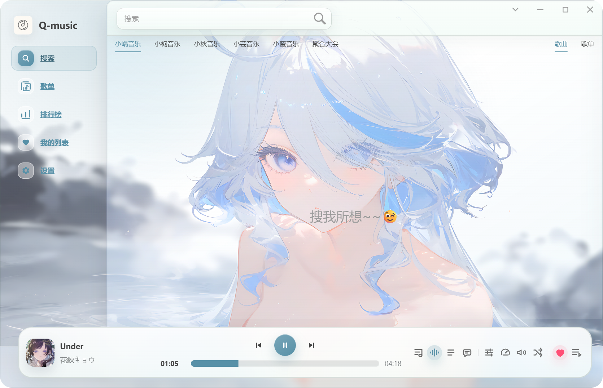

<p align="center">
  
</p>

<h1 align="center">Q-music 桌面版</h1>

<p align="center">
  <a href="https://github.com/Nshpiter/Q-music/releases"></a>
  <a href="./LICENSE"></a>
  
  
</p>

<p align="center">基于 Electron 与 Vue 3 的桌面音乐软件，专注于清爽的玻璃质感界面与完整的桌面播放体验。</p>



## 项目说明

Q-music 基于 [LX Music 桌面版](https://github.com/lyswhut/lx-music-desktop) 二次开发。当前 `v0.2.0` 基于 LX Music Desktop `2.12.2`，主要调整了应用品牌、界面风格、播放详情页、音频可视化、播放队列以及打包更新配置。

本仓库不是 LX Music 官方仓库，也不代表原作者对本项目提供支持或背书。完整变更可查看 [更新日志](./publish/changeLog.md) 与 [二次修改说明](./MODIFICATIONS.md)。

## 功能亮点

- 液态玻璃界面：支持全局背景图、面板透明度与模糊程度实时调节。
- 主题化视觉：主题预览卡、磨砂菜单、胶囊标签和统一的导航选中态。
- 重做播放栏：播放控制居中、主题色进度条、拖拽圆点和分组工具按钮。
- 播放详情页：唱片式封面、氛围背景、歌词、评论与音频可视化。
- 列表体验：播放中高亮、均衡跳动提示、磨砂悬停效果和播放队列。
- 桌面能力：桌面歌词、全局快捷键、音效设置、数据同步与开放 API。
- 独立更新：使用 Q-music 的版本检测、发布地址和 `qmusic://` Scheme URL，不与上游安装冲突。

当前主要发布与测试平台为 Windows 10 / 11。软件下载请前往 [GitHub Releases](https://github.com/Nshpiter/Q-music/releases)。

## 数据存储

Windows 默认数据目录：

```text
%APPDATA%/q-music
```

若程序目录中存在 `portable` 文件夹，则使用 `portable/userData` 保存数据。

## 本地开发

环境要求：

- Node.js >= 22
- npm >= 8.5.2

安装依赖并启动开发版：

```bash
npm ci
npm run dev
```

质量检查与生产构建：

```bash
npm run lint
npm run build
```

`npm run build` 只生成生产环境代码；构建 Windows x64 安装包请运行：

```bash
npm run pack
```

安装包默认输出到：

```text
build/Q-music-v<version>-x64-Setup.exe
```

## 问题反馈与贡献

Q-music 相关问题请在 [Q-music Issues](https://github.com/Nshpiter/Q-music/issues) 反馈，并尽量附上系统版本、软件版本、复现步骤和相关日志。上游通用使用问题可先参考 [LX Music 桌面版常见问题](https://lyswhut.github.io/lx-music-doc/desktop/faq)。

提交 PR 时请保持改动聚焦，说明变更目的与影响范围，并避免提交构建产物、私有配置、Token 或无关格式化改动。

## 许可与免责声明

本项目基于 [Apache License 2.0](./LICENSE) 发行，并保留 LX Music 桌面版的上游归属声明、附加协议与免责声明。上游信息与二次修改记录见 [NOTICE](./NOTICE) 和 [MODIFICATIONS.md](./MODIFICATIONS.md)。

- Q-music 是 LX Music 桌面版的独立二次修改版本，并非官方版本。
- 本项目不拥有任何音乐平台数据、音频、歌词、封面等版权数据。
- 使用者应自行确认所在地法律法规、音乐平台条款与版权要求，并自行承担使用风险。
