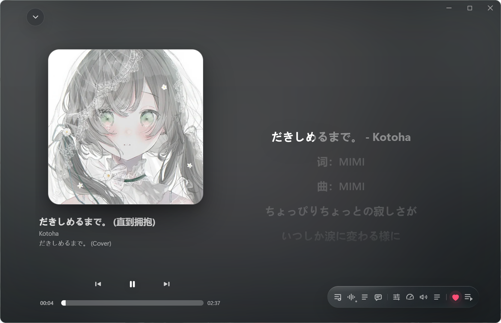
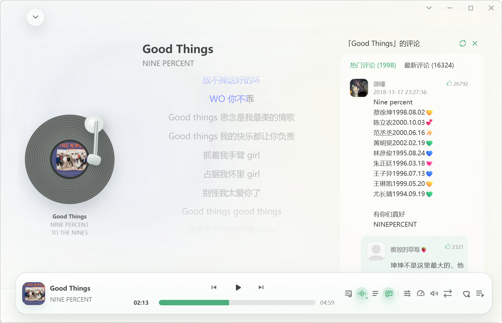

<p align="center">
  
</p>

<h1 align="center">Q-music</h1>

<p align="center">
  <a href="https://github.com/Nshpiter/Q-music/releases"></a>
  <a href="./LICENSE"></a>
  
  
  
  
  
</p>

<p align="center">面向 Windows、Arch Linux 与 Android 的多端音乐播放器，提供聚合搜索、账号推荐、歌单同步与沉浸式歌词体验。</p>

<p align="center">
  <a href="https://github.com/Nshpiter/Q-music/releases/latest"><strong>下载最新版本</strong></a>
  ·
  <a href="./publish/changeLog.md">更新日志</a>
  ·
  <a href="https://github.com/Nshpiter/Q-music/issues">问题反馈</a>
</p>

## 界面预览

### 每日推荐与完整歌单


<table>
  <tr>
    <td width="50%" align="center"><strong>沉浸歌词与动态氛围</strong></td>
    <td width="50%" align="center"><strong>经典歌词与播放栏</strong></td>
  </tr>
  <tr>
    <td></td>
    <td></td>
  </tr>
</table>

## 项目说明

Q-music 基于 [LX Music 桌面版](https://github.com/lyswhut/lx-music-desktop) 二次开发。当前桌面端与 Android 端版本均为 `v0.3.18`；桌面端基于 LX Music Desktop `2.12.2`，主要重做了跨端界面、首页推荐、音乐账号接入、歌单同步、播放详情页、音频可视化与发布更新流程。

本仓库不是 LX Music 官方仓库，也不代表原作者对本项目提供支持或背书。完整变更可查看 [更新日志](./publish/changeLog.md) 与 [二次修改说明](./MODIFICATIONS.md)。

## 下载与平台

| 平台 | 安装方式 | 状态 |
| --- | --- | --- |
| Windows 10 / 11 x64 | 从 [GitHub Releases](https://github.com/Nshpiter/Q-music/releases/latest) 下载 `Q-music-*-x64-Setup.exe` | 稳定 |
| Android arm64-v8a | 从 [GitHub Releases](https://github.com/Nshpiter/Q-music/releases/latest) 下载 arm64 APK；架构不确定时使用 universal APK | 测试版 |
| Arch Linux x86_64 | 按下文命令构建 pacman 包 | 测试版 |

Android 源码位于本仓库 [`android`](https://github.com/Nshpiter/Q-music/tree/android) 分支。Release 同时提供 SHA256 校验文件，Windows 客户端支持应用内检查更新。

## 功能亮点

- 液态玻璃界面：支持全局背景图、面板透明度与模糊程度实时调节，并提供清晰、平衡、沉浸三档外观预设。
- 流畅模式：一键关闭实时毛玻璃采样，保留配色与层次，降低低功耗设备、远程桌面及部分 Linux 合成器的图形压力。
- 主题化视觉：主题预览卡、磨砂菜单、胶囊标签和统一的导航选中态。
- 聚合搜索：一个结果条目聚合多个音乐来源，可按歌曲选择可用来源，首页不堆叠来源标签。
- 智能播放线路：QQ 音乐与网易云音乐优先请求官方可用地址，失败后自动回退到自定义接口及跨源匹配，不改变其他音乐源行为。
- 音乐账号：支持 QQ 音乐与网易云音乐授权状态检测、账号歌单读取及推荐来源切换。
- 每日推荐：支持 QQ 音乐每日 30 首、私人雷达与网易云音乐推荐，并提供完整歌单详情、一键播放和换一批。
- 歌单导入：支持账号歌单同步与外部歌单链接导入，统一管理本地收藏和跨平台歌单。
- 多端云同步：可连接独立同步服务，在 Windows、Arch Linux 与 Android 间自动同步歌单及“不喜欢”列表。
- 重做播放栏：播放控制居中、主题色进度条、拖拽圆点和分组工具按钮。
- 播放详情页：提供经典与沉浸两种布局，支持逐行歌词、评论面板、自动沉浸控件及多种音频可视化。
- 列表体验：播放中高亮、均衡跳动提示、磨砂悬停效果和播放队列。
- 桌面能力：桌面歌词、全局快捷键、音效设置、数据同步与开放 API。
- 独立更新：使用 Q-music 的版本检测、发布地址和 `qmusic://` Scheme URL，不与上游安装冲突。

## 数据存储

Windows 默认数据目录：

```text
%APPDATA%/q-music
```

若程序目录中存在 `portable` 文件夹，则使用 `portable/userData` 保存数据。

Linux 默认数据目录：

```text
$XDG_CONFIG_HOME/q-music
```

未设置 `XDG_CONFIG_HOME` 时通常为 `~/.config/q-music`。

## 多端云同步

项目提供了 [Docker 部署配置](./deploy/sync-server/README.md)。部署同步服务并配置可信 HTTPS 后，
在客户端“设置 → 数据同步”中选择客户端模式，填写服务地址并输入连接码即可。首次认证后，
客户端会缓存设备密钥并自动重连。

## 本地开发

环境要求：

- Node.js >= 22
- npm >= 8.5.2

安装依赖并启动开发版：

```bash
npm ci
npm run dev
```

质量检查与生产构建：

```bash
npm run lint
npm run build
```

`npm run build` 只生成生产环境代码；构建 Windows x64 安装包请运行：

```bash
npm run pack
```

安装包默认输出到：

```text
build/Q-music-v<version>-x64-Setup.exe
```

## Arch Linux

生成 x86_64 pacman 包：

```bash
npm ci
npm run pack:arch
```

安装本地构建产物：

```bash
sudo pacman -U ./build/Q-music_0.3.18_x64.pacman
```

pacman 安装由系统包管理器负责升级；应用内会提示新版本，但不会自行覆盖系统
软件包。Electron 在原生 Wayland 下默认使用 ANGLE/EGL（`--use-gl=angle
--use-angle=gl`）启用 GPU 合成，并尝试通过桌面环境提供的 portal 注册全局快捷
键；X11/XWayland 仍使用桌面 OpenGL。应用会尊重显式传入的图形后端参数，若需
排查驱动兼容性可临时改回桌面 OpenGL：

```bash
q-music --use-gl=desktop
```

原生 Wayland 会自动使用轻量合成路径：关闭大面积实时毛玻璃采样，并降低全屏
音频可视化的绘制分辨率与刷新率，同时保留当前主题配色与面板层次。需要进一步
降低开销时，仍可在“设置 → 基本设置”开启“流畅模式”。

若桌面歌词的位置、置顶或透明效果受合成器限制，可临时回退到 XWayland：

```bash
q-music --ozone-platform=x11
```

Arch 真机建议至少回归：启动与单实例、在线/本地播放、媒体键、托盘、全局快捷
键、桌面歌词、`qmusic://` 深链，以及与 Android 端的局域网同步。

## 问题反馈与贡献

Q-music 相关问题请在 [Q-music Issues](https://github.com/Nshpiter/Q-music/issues) 反馈，并尽量附上系统版本、软件版本、复现步骤和相关日志。上游通用使用问题可先参考 [LX Music 桌面版常见问题](https://lyswhut.github.io/lx-music-doc/desktop/faq)。

提交 PR 时请保持改动聚焦，说明变更目的与影响范围，并避免提交构建产物、私有配置、Token 或无关格式化改动。

## 许可与免责声明

本项目基于 [Apache License 2.0](./LICENSE) 发行，并保留 LX Music 桌面版的上游归属声明、附加协议与免责声明。上游信息与二次修改记录见 [NOTICE](./NOTICE) 和 [MODIFICATIONS.md](./MODIFICATIONS.md)。

- Q-music 是 LX Music 桌面版的独立二次修改版本，并非官方版本。
- 本项目不拥有任何音乐平台数据、音频、歌词、封面等版权数据。
- 使用者应自行确认所在地法律法规、音乐平台条款与版权要求，并自行承担使用风险。
